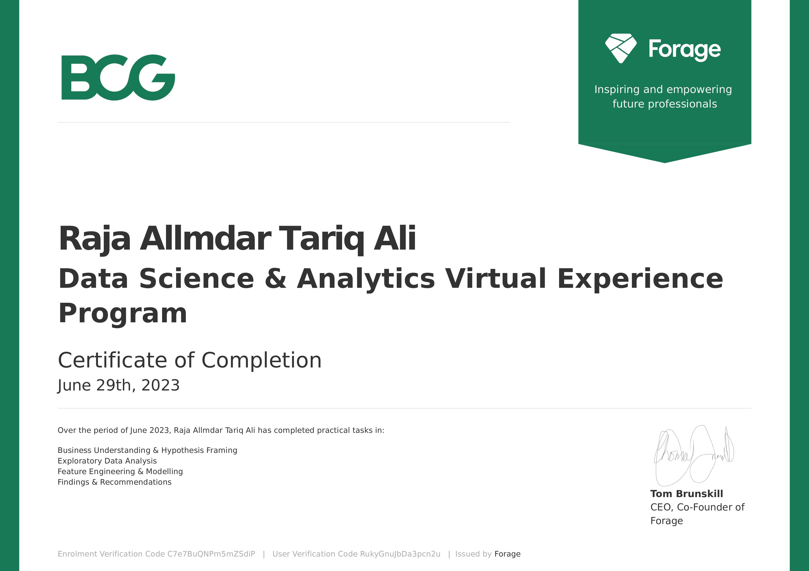

# BCG Data Science and Analytics Virtual Experience Program

This GitHub repository documents my progress and shares insights from the "BCG Data Science and Analytics" Virtual Experience Programme offered by BCG GAMMA through Forage.

## Table of Contents

- [Program Duration and Role](#program-duration-and-role)
- [Tasks Overview](#tasks-overview)
    - [Task 1: Business Understanding and Hypothesis Framing](#task-1-business-understanding-and-hypothesis-framing)
    - [Task 2: Exploratory Data Analysis](#task-2-exploratory-data-analysis)
    - [Task 3: Feature Engineering and Modeling](#task-3-feature-engineering-and-modeling)
    - [Task 4: Findings and Recommendations](#task-4-findings-and-recommendations)
- [Certificate of Completion](#certificate-of-completion)

## Program Duration and Role

## Tasks Overview

### Task 1: Business Understanding and Hypothesis Framing

#### Objective
Formulate a data-driven approach to test the hypothesis that `customer churn` in PowerCo's SME segment is driven by price sensitivity. Outline the necessary data, ideal data framework, potential exploratory analyses, and suitable predictive models.

#### Hypothesis
"SME customers are churning due to price sensitivity, and offering a 20% discount could reduce this churn.”

#### What I learned in this task:
- Gained insights into the real-world implications of customer churn in the energy sector.
- Learned how to translate business problems into testable data science hypotheses.
- Gained knowledge about the end-to-end process of predictive modeling.
- Produced a deliverable in the form of a professional email outlining the approach to the hypothesis testing.

### Task 2: Exploratory Data Analysis

### Task 3: Feature Engineering and Modeling

### Task 4: Findings and Recommendations

#### Objective
Create a clear, concise, and persuasive executive summary slide that synthesizes key findings from the project for a non-technical audience, articulates their impact on the client's bottom line, and suggests potential courses of action. Prepare it for presentation in a stakeholders' meeting.

#### What I learned in this task:
- How to distill complex project findings into a concise and business-focused executive summary. This includes understanding the key insights derived from the project, their impact on the client's bottom line, and potential courses of action.
- The significance of understanding your audience when communicating technical findings. The executive summary should be tailored in a way that it is accessible and meaningful to non-technical stakeholders, emphasizing strategic implications over raw data or technical details.

## Certificate of Completion
